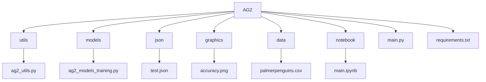

# AG2

Repositório do projeto da Avaliação Global 2 (AG2) proposta no 7° período do Instituto Nacional de Telecomunicações - INATEL.

## Overview

Este projeto é dedicado ao treinamento de um modelo de machine learning para a classificação de diferentes tipos de pinguins utilizando o algoritmo **Decision Tree**. O objetivo é desenvolver um modelo que, após ser treinado com dados específicos, possa classificar corretamente as espécies de pinguins com base nas características fornecidas. 

## Index

- [Estrutura de Pastas](#estrutura-de-pastas)
- [Descrição das Pastas](#descrição-das-pastas)
  - [utils](#utils)
  - [models](#models)
  - [json](#json)
  - [graphics](#graphics)
  - [data](#data)
  - [notebook](#notebook)
- [Configuração do Ambiente](#configuração-do-ambiente)
  - [Criação e Ativação da Virtual Environment](#criação-e-ativação-da-virtual-environment)
  - [Instalação das Dependências](#instalação-das-dependências)
- [Como Executar o Projeto](#como-executar-o-projeto)

## Estrutura de Pastas

A estrutura de diretórios do projeto é organizada da seguinte forma:




## Descrição das Pastas

### utils

A pasta `utils` contém códigos que auxiliam no projeto principal. Atualmente, possui o código que trata os dados que serão entregues ao modelo. Este código também é responsável por gerar um gráfico da acurácia que o modelo atingiu na etapa de validação.

### models

A pasta `models` guarda os códigos dedicados ao treinamento e teste do modelo. O código principal nesta pasta é o que implementa a **Decision Tree** para a classificação de pinguins.

### json

A pasta `json` é dedicada a armazenar um arquivo `.json` que possui os dados que serão utilizados para testar o modelo. Estes dados são separados do dataset principal e são formatados especificamente para a etapa de teste.

### graphics

A pasta `graphics` armazena o gráfico de acurácia do modelo treinado. Este gráfico é gerado durante a etapa de validação para mostrar o desempenho do modelo.

### data

A pasta `data` contém o dataset que será utilizado no projeto. Este dataset é utilizado para treinar o modelo de **Decision Tree** com dados reais sobre diferentes espécies de pinguins.

### notebook

A pasta `notebook` guarda um arquivo `ipynb` que serve como um auxiliar para a visualização de cada passo do projeto. É útil para acompanhar o desenvolvimento e verificar os resultados intermediários durante o processo de modelagem.

## Configuração do Ambiente

### Criação e Ativação da Virtual Environment

Para configurar o ambiente e garantir que todas as dependências sejam instaladas corretamente, é necessário criar e ativar um ambiente virtual (`venv`). Siga os passos abaixo:

1. Crie um ambiente virtual com o comando:

   ```bash
   python -m venv ag2env
   ```

2. Ative o ambiente virtual:
   - Windows:
        ```bash
        .\ag2env\Scripts\activate
        ```
   - Linux/macOS:
        ```bash
        source ag2env/bin/activate
        ```

### Instalação das Dependências
Com o ambiente virtual ativado, instale as dependências necessárias executando o comando abaixo:
```bash
pip install -r requirements.txt
```

## Como Executar o Projeto
Com o ambiente configurado e as dependências instaladas, o projeto pode ser executado com o comando abaixo:
```bash
python main.py
```

Este comando irá iniciar o processo de tratamento de dados, treinamento do modelo e teste, gerando os gráficos de acurácia e apresentando os resultados da classificação dos pinguins.
